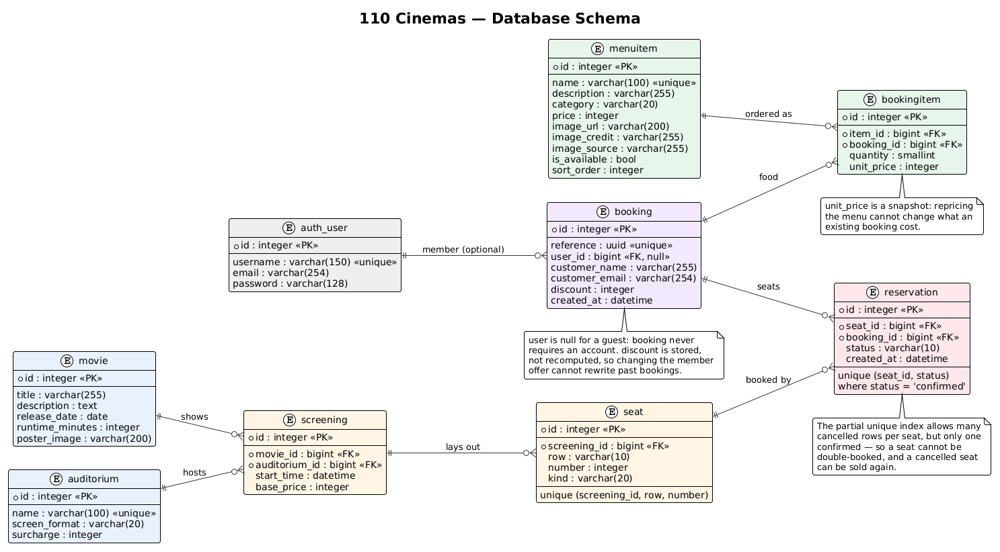

# 110 Cinemas

Browse what's on, pick your seats on a real seat map, and book them. No account
needed.

Django + HTMX, SQLite, no build step.

## Try it live

**https://one10-cinemas.onrender.com**

It's on render's free tier, so the first request after a quiet spell takes
around 50 seconds to wake the server up. After that it's quick. The demo
catalogue is reseeded on every deploy, so any bookings you make are temporary.

## Run it on your machine

You need [uv](https://docs.astral.sh/uv/) and Python 3.12+. Nothing else — the
database is a file and there is no front-end build.

```bash
git clone https://github.com/MithunThangaraj/110-cinemas.git
cd 110-cinemas
uv sync
```

Set up the database and fill it with the demo catalogue:

```bash
uv run python manage.py migrate
uv run python manage.py seed_demo_data
uv run python manage.py fetch_posters
uv run python manage.py fetch_menu_images
```

Start it:

```bash
uv run python manage.py runserver
```

Then open **http://localhost:8000/**.

That's it. `seed_demo_data` creates nine films, five auditoriums covering all
four screen formats, and the concession menu; the two `fetch_` commands pull
real pictures for them (no API key needed — see [Pictures](#pictures)). All
three are safe to re-run.

### Optional: the Django admin

To add your own movies and screenings, create a login:

```bash
uv run python manage.py createsuperuser
```

then go to **http://localhost:8000/admin/**. Saving a screening generates its
seats automatically, laid out to match the auditorium you picked.

### Optional: watch the seat map update live

The seat map refreshes itself while you're choosing. To see it:

1. Open the same screening in two browser windows side by side.
2. Book a seat in one.
3. Within about 8 seconds the other greys that seat out — without losing the
   seats you had already selected.

## Working on it

```bash
uv run pytest --cov     # tests
uv run pylint cinema    # lint
uv run black .          # format
```

### Tests

**157 tests, 96% coverage.** Run `uv run pytest --cov` to reproduce the numbers
below — they are a snapshot, not a badge, so treat the command as the source of
truth.

| File | Tests | Covers |
| --- | --- | --- |
| `test_views.py` | 52 | pages, the booking flow, HTMX partials, polling, cancelling |
| `test_models.py` | 38 | models, layouts, pricing, and the booking service |
| `test_accounts.py` | 23 | sign-up, log-in, the member discount, guest booking |
| `test_menu.py` | 20 | the concession menu and ordering with a booking |
| `test_posters.py` | 14 | poster lookup and the fetch command |
| `test_commands.py` | 7 | seeding demo data |
| `test_forms.py` | 3 | the search form |

`services.py` and `urls.py` are at 100%; `models.py` and `views.py` at 96%. The
gaps are mostly old migrations, which are not worth exercising.

Some tests worth knowing exist, because they pin decisions rather than
mechanics:

- **`test_price_is_snapshotted_so_a_menu_change_cannot_alter_a_booking`** —
  reprices the menu and asserts an existing booking does not move.
- **`test_changing_the_offer_cannot_rewrite_a_past_booking`** — same idea for
  the member discount.
- **`test_seat_map_does_not_scale_queries_with_seat_count`** — caps a 432-seat
  IMAX page at 12 queries, so the N+1 cannot come back.
- **`test_a_seat_taken_while_typing_sends_them_back_to_the_map`** — seats are
  not held during the details step, and that has to fail gracefully.
- **`test_cancel_requires_a_csrf_token`** — the session check is not the only
  thing protecting a booking.
- **`test_partly_cancelled_booking_still_offers_cancelling`** — a regression
  test for a real bug found in review (see below).

Network calls are never made in tests: `find_poster_url` and `find_image` both
take their HTTP function as an argument, so the tests inject a fake.

### Code review

Every substantial pull request was reviewed against
[`.claude/skills/code-review-expert`](.claude/skills/code-review-expert/SKILL.md)
before merging, with the findings recorded on GitHub:

| PR | Reviewed |
| --- | --- |
| [#29](https://github.com/MithunThangaraj/110-cinemas/pull/29) | auditorium formats, yen pricing, live seat map |
| [#27](https://github.com/MithunThangaraj/110-cinemas/pull/27) | cancelling a booking |
| [#25](https://github.com/MithunThangaraj/110-cinemas/pull/25) | posters, multi-seat booking |
| [#23](https://github.com/MithunThangaraj/110-cinemas/pull/23) | interface redesign |
| [#21](https://github.com/MithunThangaraj/110-cinemas/pull/21) | the render deploy fix |

13 issues, 23 pull requests, each PR closing an issue.

The reviews were not a formality. The one on
[#27](https://github.com/MithunThangaraj/110-cinemas/pull/27) found a real bug:
booking status was read from a single reservation, so a booking whose first
seat had been cancelled on its own reported itself cancelled and hid the cancel
control — stranding the seats that were still sold. It was reproduced, fixed,
and pinned with a regression test in the same PR.

The review on [#25](https://github.com/MithunThangaraj/110-cinemas/pull/25)
raised the `Seat.is_available` N+1 while it was still harmless at 96 seats;
it was fixed when IMAX GT made it ~430 queries on the busiest page.

## How it works

### The data model



Seven tables. The chain runs **movie + auditorium → screening → seat →
reservation**, with `booking` tying a visit together and `menuitem →
bookingitem` for the concession stand.

Two things on there are worth knowing about:

- **The `on_delete` rules are deliberate.** Deleting a movie cascades away its
  screenings and seats, which are meaningless without it. But an auditorium
  with screenings, or a menu item somebody has ordered, is `PROTECT`ed —
  deleting either would destroy booking history.
- **A seat cannot be double-booked, by the database.** The partial unique index
  `(seat_id, status) WHERE status = 'confirmed'` allows any number of cancelled
  rows per seat but only one confirmed, which is also what lets a cancelled
  seat be sold again.

The source is [`docs/schema.puml`](docs/schema.puml); re-render it with the
command in [`docs/README.md`](docs/README.md) if the models change.

### Auditoriums, seat maps and prices

A screening runs in an **`Auditorium`**, whose format decides both its seat map
and its price. The layouts live in [`cinema/layouts.py`](cinema/layouts.py):

| Format | Rows | Seats per row (front → back) | Total | Surcharge |
| --- | --- | --- | --- | --- |
| IMAX GT | 18 | 18 → 26 | 432 | +¥1,000 |
| Dolby Cinema | 13 | 18 → 22 | 276 | +¥1,000 |
| 4DX | 8 | 12 → 14 | 109 | +¥1,200 |
| Standard | 10 | 15 → 18 | 174 | — |

Rows **taper toward the screen**: the front rows are closest to it and hold
fewer seats, so the map is a trapezoid rather than a block. Aisles are measured
in from each end of a row, so they stay lined up even though rows differ in
length.

Prices are in yen, which has no minor unit, so `base_price` is a whole number.
One seat costs `screening.base_price + auditorium.surcharge + seat surcharge`,
where a premium (centre block) seat adds ¥500. So a premium seat at an IMAX GT
screening is ¥2,000 + ¥1,000 + ¥500 = **¥3,500**.

Every layout includes **wheelchair spaces**, marked on the map. They are never
sold at the premium rate, even when they sit inside the premium block.

### Accounts

Accounts are free and entirely optional. A member gets **¥500 off a booking**
and keeps their booking history; a guest books with no account at all and sees
their bookings for as long as the browser session lasts.

The discount is recorded on the `Booking` row rather than recomputed when the
page is rendered, so changing the offer cannot rewrite what a past booking
cost — the same reasoning as `BookingItem.unit_price`. It applies once per
booking, not per seat, and the total never goes below zero.

### Booking

Booking is two steps and needs no account:

1. **Choose seats** — up to 6, on the map.
2. **Say who it is for** — a name and email, then confirm.

A member's details are filled in for them. The chosen seats travel with the
form as hidden inputs rather than sitting in the session, so a stale tab cannot
book seats you have forgotten about. Nothing is held while you type: if a seat
goes in the meantime the booking fails cleanly and you are returned to the map.

Seats booked together belong to one `Booking` and are reserved all-or-nothing:
if any one of them is taken, none are booked. The limit lives in
[`cinema/services.py`](cinema/services.py) as `MAX_SEATS_PER_BOOKING` and is
enforced on the server; the browser only mirrors it.

A booking can be cancelled from the ticket or from **My Bookings**, which puts
every seat back on sale. A booking belongs either to the member who made it or,
for a guest, to the browser session that made it — cancelling requires one of
those, so a leaked booking link cannot release someone else's seats.

### Food and drink

The concession menu lives at `/menu/` and can be added to a booking on the
details step: pick quantities and the total updates as you go.

Menu items are priced in yen like tickets. `BookingItem` stores a **snapshot**
of the price at the time of the order, so changing the menu later cannot alter
what an existing booking came to.

### The review site

The booking confirmation carries a **Watch and review** button linking to a
separate project, the [Film Review App](https://film-review-app-19bh.onrender.com/).
The URL is `REVIEW_SITE_URL` in settings (overridable by environment variable);
set it to `""` and the button disappears rather than rendering dead.

It opens in a new tab with `rel="noopener noreferrer"` — without `noopener` the
opened page can reach back into this one through `window.opener`.

### Live seat availability

The seat map polls `GET /screenings/<id>/availability/` every 8 seconds. Two
things keep that from being annoying:

- The page sends the availability digest it last rendered. If nothing has been
  booked since, the view answers **204 No Content** and HTMX leaves the page
  alone — no flicker, and no focus taken from someone mid-selection.
- The poll sends the current selection (`hx-include`), so a refresh keeps your
  seats. If one was taken meanwhile, it is dropped and the page says which.

### Pictures

Both sources are free and need no API key or account, so there is nothing to
configure, locally or in production.

```bash
uv run python manage.py fetch_posters       # film posters
uv run python manage.py fetch_menu_images   # concession photographs
```

**Posters** come from Apple's **iTunes Search API**
([`cinema/posters.py`](cinema/posters.py)). Only an **exact** title match is
accepted: the API readily returns loosely related films, and the wrong poster
is worse than none. Its film coverage is incomplete, so a movie with no match
keeps its generated key-art — a coloured card whose palette comes from the
title — instead of showing a broken image.

**Menu photographs** come from **Wikimedia Commons**
([`cinema/commons.py`](cinema/commons.py)). Everything there is freely
licensed, which is why the menu can use real photographs where film posters
cannot. Files are looked up by exact title rather than by search — a search for
"nachos" returns a portrait of the man who invented them — so each item stores
the Commons file title in `image_source`. The photographer and licence are
stored alongside and listed under **Photo credits** at the foot of the menu —
six of the ten photographs are CC BY, which asks for attribution, so the credit
is kept off the cards rather than dropped.

Set `Movie.poster_image` or `MenuItem.image_url` by hand in the admin to
override either result.

## Where things live

```
cinema/
  models.py      Movie, Auditorium, Screening, Seat,
                 Booking, Reservation, MenuItem, BookingItem
  layouts.py     seat layout per screen format
  services.py    booking, cancelling, availability - the business rules
  views.py       thin views; HTMX partials for the seat map
  posters.py     poster lookup (iTunes)
  commons.py     menu photo lookup (Wikimedia Commons)
  templates/     page templates and partials
  static/        the stylesheet
openspec/specs/  what the app is specified to do
```

## Deployment

The app is deployed to render.com from `main`. Setup, configuration and the
production stack are documented separately in
**[DEPLOYMENT.md](DEPLOYMENT.md)** — you do not need any of it to run the app
locally.
